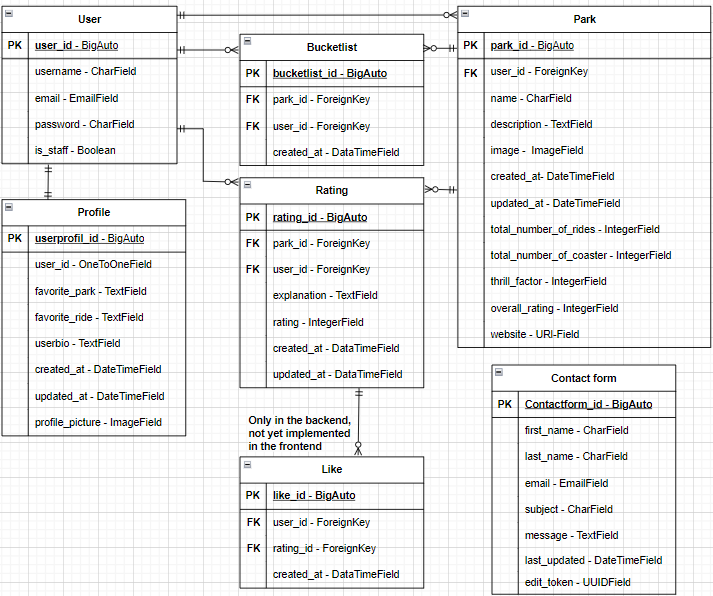

# Thrill Seeker API Readme

This is the Django Rest API for the Thrill Seeker website. The website provides you with articles about theme parks. Here the parks are rated and tips and recommendations are given for which target group the park is suitable. 

All other relevant files can be found here:  
[Live website](https://thrill-seekers-af06984a9bdb.herokuapp.com/)  
[Repository](https://github.com/SureDeveloping/thrill-seekers)  
[APi](https://thrill-seekers-api-5fd87044d4ac.herokuapp.com/)  
[API Repository](https://github.com/SureDeveloping/thrill-seeker-drf-api)  

## Content
- [Backend Userstory](#backend-userstory)
- [Database](#database)
  * [Bucketlist](#bucketlist)
  * [Contact Form](#contact-form)
  * [Likes](#likes)
  * [Parks](#parks)
  * [Profiles](#profiles)
  * [Ratings](#ratings)
- [API Endpoints](#api-endpoints)
- [Bugs](#bugs)
  * [Known bugs](#known-bugs) ??????
  * [Fixed bugs](#fixed-bugs) ??????
- [Testing](#testing)
  * [Languages](#languages)
  * [Frameworks](#frameworks)
  * [Database](#database-1)
  * [Tools](#tools)
  * [Libraries and Packages](#libraries-and-packages)
- [Deployment](#deployment)
- [Credits](#credits)   ???? 

## Backend Userstorys
To monitor the work, the following user story was created to create the backend. 

| Epic        | User Story                                                                                                                                        | Acceptance Cretary                                                                                                                                                                               | Tasks                                                                                                               | Moscow      |
| ----------- | ------------------------------------------------------------------------------------------------------------------------------------------------- | ------------------------------------------------------------------------------------------------------------------------------------------------------------------------------------------------ | ------------------------------------------------------------------------------------------------------------------- | ----------- |
| Backend_API | As an admin I need a stable API backend for my website to process the data entered on my website so i can set concet the front to it              | AC1: The repository  with all necessary libraries was set up                                                                                                                                     | T1: Create a repository and install all necessary libraries T2: Connected database to the backend                | Must have   |
| Backend_API | As an admin I need a model serializer view and urls for the Parks app  so i can set concet the front to it                                        | AC1: The backend for the park app works on the local server and on the deployed heroku version AC2: The CRUD function is working                                                              | T1: Create the model T2: Create the view T3: Create the serializer T4: Create the URLs T5: Test the app | Must have   |
| Backend_API | As an admin I need a model serializer view and urls for the Bucketlist app  so i can set concet the front to it                                   | AC1: The backend for the bucketlist app works on the local server  and on the deployed heroku version                                                                                            | T1: Create the model T2: Create the view T3: Create the serializer T4: Create the URLs T5: Test the app | Must have   |
| Backend_API | As an admin I need a model serializer view and urls for the rating app  so i can set concet the front to it                                       | AC1: The backend for the rating app works on the local server  and on the deployed heroku version                                                                                                | T1: Create the model T2: Create the view T3: Create the serializer T4: Create the URLs T5: Test the app | Must have   |
| Backend_API | As an admin I need a model serializer view and urls for the like app  so i can set concet the front to it                                         | AC1: The backend for the like app works on the local server and on the deployed heroku version                                                                                                   | T1: Create the model T2: Create the view T3: Create the serializer T4: Create the URLs T5: Test the app | Could have  |
| Backend_API | As an admin I need a model serializer view and urls for the Contact form app  so i can set concet the front to it                                 | AC1: The backend for the contact app works on the local server and on the deployed heroku version                                                                                                | T1: Create the model T2: Create the view T3: Create the serializer T4: Create the URLs T5: Test the app | Could have  |
| Backend_API | As an admin I need a model serializer view and urls for the Userprofile app  so i can set concet the front to it                                  | AC1: The backend for the userprofile app works on the local server and on the deployed heroku version                                                                                            | T1: Create the model T2: Create the view T3: Create the serializer T4: Create the URLs T5: Test the app | Could have  |
| Backend_API | As admin I want to make sure that only the owner of a user profile can change it and has to authenticate himself to prevent unauthorized changes. | AC1: The backend for the user authentication is working. AC2: Only owners of a profile can change this AC3: Every not loggin in user can read all profiles                                 | T1: Add auth, permission function to profiles app T2: Test the auth, permisson function                          | Must have   |
| Backend_API | As a user, I would like to see all my set likes so that I can read the corresponding ratings again                                                | AC1: In the backend, a field indicates whether a ratings is liked by a user when the user is logged in. AC2: There is a fild on my Profile which shows the number of my likes                 | T1: Add a filter for likes to the sericalizer T2: Add like count                                                 | Should have |
| Backend_API | As a user, I would like to see all my set bucketlist items so that I can plan my nest park visit                                                  | AC1: In the backend, a field indicates whether a park is on a user's bucket list when the user is logged in. AC2: There is a fild on my Profile which shows the number of my buxketlist items | T1: Add a filter for bucketlist items to the sericalizer T2: Add bucketlist count                                | Should have |
| Backend_API | As a user, I would like to see all my set ratings so that I can update them with new experiences                                                  | AC1: In the backend, a field indicates whether a a park is rated by auser's when the user is logged in. AC2: There is a fild on my Profile which shows the number of my ratings               | T1: Add a filter for a rating to the sericalizer T2: Add ratings count                                           | Should have |
| Backend_API | As a user, I would like search the parks by the name to find a park faster if it exsists.                                                         |  AC1: I can search parks by name, author(username), country                                                                                                                                   | T1: Add search function                                                                                             | Should have |
| Backend_API | As a user, I would see ratings and bucketlist count on the park page to get a better opinion on that park                                         | AC1: The bucketlist count is on the park backend page AC2: The rating count and average is on the parks backend page                                                                          | T1: Add bucketlist count T2: Add rating count and average                                                        | Should have |

## Database
This ERD Entity-Relationship Diagramm was created for the Thrill Seeker project. All the models serve the project gole and contribute to its success with their functions.

### Bucketlist: 
This model is a list of parks that a user would like to visit. In other words, a watch list for a later date.  It is linked to the user model and the park model. 

### Contact Form: 
Visitors to the website can use the contact form model to send a message that is saved. The model contains first_name, last_name, email, subject, message, last_updated and an edit_token. This allows the data to be updated once, after the user has checked it. The edit token is used for verification and secure the model against misuse.

### Likes: 
This model contains the Likes. These can be created by logged-in users for ratings. It is connected to the user models via and to the rating via a foreign key. It also contains a "created at" field. The likes app is not yet available in the front. For the future, this has been integrated into the backend so that this function can be added quickly.

### Parks: 
The park model presents the articles that can be created by super users (is staff) and it is linked to the user as a foreign key. It contains the name of the park, a description, a picture, the number of rides, the number of roller coasters, the thrill factor, the overall rating and the website of the park. 

### Profiles: 
The Profiles model extends the user model with additional information such as favorite-park, favorite_ride userbio, profile_picture and timestamps for created-at and updated_at. The user profile is created automatically when a user is created.

### Ratings:
This model represents ratings that can be submitted by users who are logged in. 
It is linked to the user model and the parking model via a foreign key. It also contains a rating as an integer field, a reason for this rating, created at, updated at and last visited field. 

## API Endpoins
The following table provides an overview of all API endpoints. It also includes the HTTP Metod, CRUD Operation and View Type with a short description.

| Root Route     | Endpoint                     | HTTP Method | CRUD Operation | View Type           | Description                                                                     |
| -------------- | ---------------------------- | ----------- | -------------- | ------------------- | ------------------------------------------------------------------------------- |
|                | /                            | GET         | Read           | Function-based view | Root route                                                                      |
| Authentication |                              |             |                |                     |                                                                                 |
|                | /admin/                      | GET         | Read           | Django Admin        | Django admin interface                                                          |
|                | /dj-rest-auth/logout/        | POST        | Delete         | Function-based view | Custom logout route                                                             |
|                | /dj-rest-auth/login/         | POST        | Create         | DRF built-in view   | User login                                                                      |
|                | /dj-rest-auth/user/          | GET         | Read           | DRF built-in view   | Get current user details                                                        |
|                | /dj-rest-auth/user/          | PUT         | Update         | DRF built-in view   | Update current user details                                                     |
|                | /dj-rest-auth/registration/  | POST        | Create         | DRF built-in view   | User registration                                                               |
|                |                              |             |                |                     |                                                                                 |
| Bucketlist     |                              |             |                |                     |                                                                                 |
|                | /bucketlist/                 | GET         | Read           | ListAPIView         | List all bucketlist items                                                       |
|                | /bucketlist/                 | POST        | Create         | CreateAPIView       | Create a new bucketlist (authenticated users only)                              |
|                | /bucketlist/{id}/            | GET         | Read           | RetrieveAPIView     | Retrieve a specific bucketlist                                                  |
|                | /bucketlist/{id}/            | DELETE      | Delete         | DestroyAPIView      | Delete a specific bucketlist item (owner only)                                  |
|                |                              |             |                |                     |                                                                                 |
| Contact Form   |                              |             |                |                     |                                                                                 |
|                | /contact/                    | GET         | Read           | ListAPIView         | List all contact form messages                                                  |
|                | /contact/create/             | POST        | Create         | CreateAPIView       | Create a new contact message                                                    |
|                | contact/update/{edit_token}/ | GET         | Read           | RetrieveAPIView     | Retrieve the just created contact message authenticated via a unique edit_token |
|                | contact/update/{edit_token}/ | PUT         | Update         | UpdateAPIView       | Update the just created contact message. authenticated via a unique edit_token  |
|                | contact/update/{edit_token}/ | DELETE      | Delete         | DestroyAPIView      | Delete the just created contact message. authenticated via a unique edit_token  |
|                |                              |             |                |                     |                                                                                 |
| Likes          |                              |             |                |                     |                                                                                 |
|                | /likes/                      | GET         | Read           | ListAPIView         | List all likes                                                                  |
|                | /likes/                      | POST        | Create         | CreateAPIView       | Create a new like (authenticated users only)                                    |
|                | /likes/{id}/                 | GET         | Read           | RetrieveAPIView     | Retrieve a specific like                                                        |
|                | /likes/{id}/                 | DELETE      | Delete         | DestroyAPIView      | Delete a specific like (owner only)                                             |
|                |                              |             |                |                     |                                                                                 |
| Parks          |                              |             |                |                     |                                                                                 |
|                | /parks/                      | GET         | Read           | ListAPIView         | Retrieve a list of parks                                                        |
|                | /parks/                      | POST        | Create         | CreateAPIView       | Create a new park                                                               |
|                | /parks/{id}/                 | GET         | Read           | RetrieveAPIView     | Retrieve a specific park by ID                                                  |
|                | /parks/{id}/                 | PUT         | Update         | UpdateAPIView       | Update a specific park by ID                                                    |
|                | /parks/{id}/                 | DELETE      | Delete         | DestroyAPIView      | Delete a specific park by ID                                                    |
|                |                              |             |                |                     |                                                                                 |
| Profiles       |                              |             |                |                     |                                                                                 |
|                | /profiles/                   | GET         | Read           | ListAPIView         | List all profiles (logged in users)                                             |
|                | /profiles/{id}/              | GET         | Read           | RetrieveAPIView     | Retrieve a specific profile (logged in users)                                   |
|                | /profiles/{id}/              | PUT         | Update         | UpdateAPIView       | Update a specific profile (owner only)                                          |
|                |                              |             |                |                     |                                                                                 |
| Ratings        |                              |             |                |                     |                                                                                 |
|                | /ratings/                    | GET         | Read           | ListAPIView         | List all ratings                                                                |
|                | /ratings/                    | POST        | Create         | CreateAPIView       | Create a new rating (authenticated users only)                                  |
|                | ratings/{id}/                | GET         | Read           | RetrieveAPIView     | Retrieve a specific rating                                                      |
|                | /ratings/{id}/               | PUT         | Update         | UpdateAPIView       | Update a specific rating (owner only)                                           |
|                | /ratings/{id}/               | DELETE      | Delete         | DestroyAPIView      | Delete a specific rating (owner only)                                           |

## Bugs
?????????????

### Known bugs
???????????????????????????

### Fixed bugs 
Here is a summary of the identified bugs along with brief descriptions of their fixes. luding the bug report, commits, and the steps taken to resolve the issue.??????????????????????????????????????????

## Testing
The tests for the Thrill Seeker Api are listed in a separate file. This file can be found here. [TESTING.md](./TESTING.md)

### Languages
- Python
- Markdown

### Frameworks
The Django rest framework was used for the API of this project.

### Database
The PostgreSQL database from Code Institute was used as the database.

### Software and Tools
- Draw.io - To create the ERD
- Gitpod - IDE to code the project
- Git - For version control
- Heroku – to deploy the website
- Github - to store the website
- Excel - to create for the readme and the testing.md tabels
- Pep8 CI Python Linter - To Linter the python
- Cloudinary - For managing and saving images
- Code Institute Postgres Database - PostgreSQL database for this project

### Libraries and Packages
- asgiref==3.3.4 - ASGI (Asynchronous Server Gateway Interface) specification, used by Django for asynchronous support
- certifi==2024.6.2 - A collection of root certificates for SSL/TLS verification
- cffi==1.16.0 - C Foreign Function Interface for Python.
- charset-normalizer==3.3.2 - Library for character encoding detection
- cloudinary==1.33.0 - Python SDK for Cloudinary, a cloud service for image and video management
- cryptography==3.4.8 - Library for various cryptographic operations
- defusedxml==0.7.1 - XML bomb protection for Python stdlib modules
- dj-database-url==0.5.0 - Utility to configure Django database using URLs
- dj-rest-auth==2.1.9 - Authentication views for Django REST Framework
- Django==3.2.4 - The core Django web framework
- django-allauth==0.44.0 - Integrated set of Django applications addressing authentication, registration, account management
- django-cloudinary-storage==0.3.0 - Django package that provides Cloudinary storages for both media and static files
- django-cors-headers==3.7.0 - Django application for handling the server headers required for Cross-Origin Resource Sharing (CORS)
- django-filter==2.4.0 - Django application for allowing users to filter querysets dynamically
- djangorestframework==3.12.4 - Powerful and flexible toolkit for building Web APIs in Django
- djangorestframework-simplejwt==4.7.2 - JSON Web Token authentication plugin for Django REST Framework
- gunicorn==20.1.0 - Python WSGI HTTP Server for UNIX, often used to deploy Django applications
- idna==3.7 - Internationalized Domain Names in Applications (IDNA) support
- oauthlib==3.1.1 - Generic, spec-compliant implementation of OAuth for Python
- Pillow==8.2.0 - Python Imaging Library (Fork), for opening, manipulating, and saving many different image file formats
- psycopg2==2.9.1 - PostgreSQL adapter for Python
- pycparser==2.22 - C parser in Python, required by some Python packages that interface with C code
- PyJWT==2.1.0 - JSON Web Token implementation in Pytho
- python3-openid==3.2.0 - OpenID support for modern servers and consumers
- pytz==2021.1 - World timezone definitions for Python
- requests==2.32.3 - HTTP library for Python
- requests-oauthlib==1.3.0 - OAuthlib authentication support for Requests
- six==1.16.0 - Python 2 and 3 compatibility library
- sqlparse==0.4.1 - Non-validating SQL parser for Python

## Deployment
Deploying the Django backend :
It is assumed that user accounts exist for the respective services used and that usage rights are available.

1. Set DEBUG in the settings.py file to False to ensure that the application runs in production mode during deployment. 
2. Log in to the Heroku account, create a new Heroku app. and select a region.
3. Set the local environment variables, env.py file for the PostgreSQL URL, the Cloudinary URL and the secret Django key. These variables must also be added in the Heroku app under the Config Vars section. To communicate with the Heroku application. Avoid exposing your environment variables in your public repository. Use the Config Vars section in Heroku to securely set your environment variables.
4. Perform all database migrations and have the current state of the models in the database schema. Commit and push all changes to the GitHub repository. The commands python manage.py makemigrations and python manage.py migrate were used for this. 
4. In the Heroku dashboard, the created app is connected to the GitHub repository under the "Deployment method" section on the deployment page. The app is then deployed via "Manual deployment" by clicking the Deploy Branch button. After successful deployment, Heroku provides a URL for accessing the live application. 

## Credits ????
email senden für user profile???
edit token
[django-versatileimagefield - Custom filters](https://django-versatileimagefield.readthedocs.io/en/2.1/writing_custom_sizers_and_filters.html)