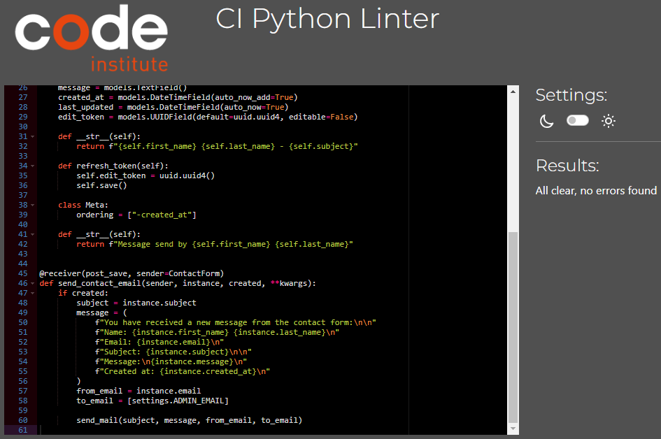
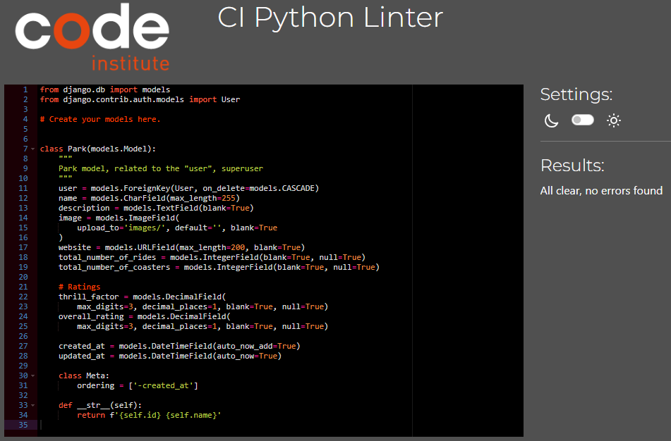
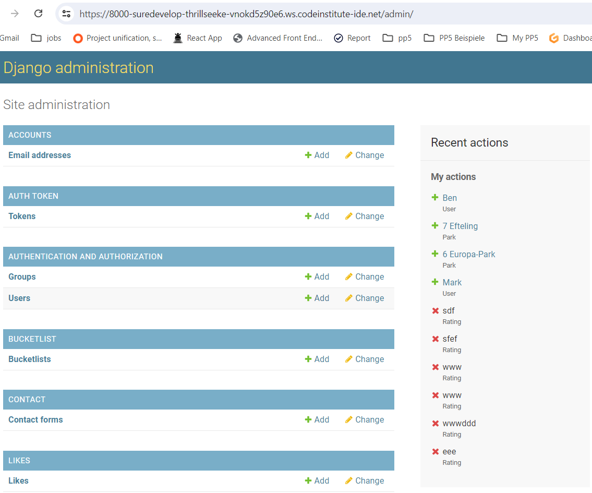
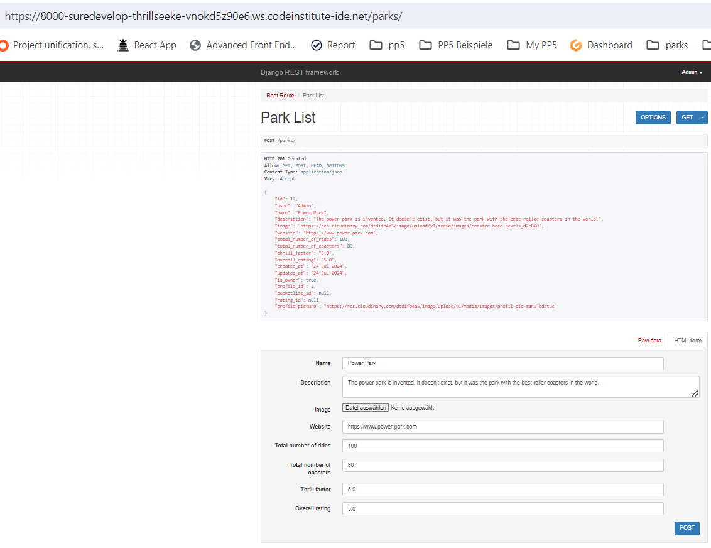

# Thrill Seeker API Testing

The testing.md file provides an overview of all tests that have been carried out specifically with the Thrill Seeker API.

## Content
- [Code Validation](#code-validation)
- [Manual testing](#manual-testing)
- [Resume](#resume)

### Code Validation 
The python code of the backend was checked by a Pyton linter. The code Institute python linter was used for this purpes.
[CI Python Linter](https://pep8ci.herokuapp.com/) 

#### Backend
| Tested File    | Test Result                                                                                                             | Pass            |
| -------------- | ----------------------------------------------------------------------------------------------------------------------- | --------------- |
| permissions.py | 

backend permissions

 | Pass, No errors |
| serializers.py | 

backend serializers

 | Pass, No errors |
| settings.py    | 

backend settings

    | Pass, No errors |
| urls.py        | 

backend urls

        | Pass, No errors |
| views.py       | 

backend views

       | Pass, No errors |

#### Bucketlist
| Tested File    | Test Result                                                                                                             | Pass            |
| -------------- | ----------------------------------------------------------------------------------------------------------------------- | --------------- |
| models         | 

bucketlist models

   | Pass, No errors |
| serializers.py | 

bucketlist serializers

 | Pass, No errors |
| urls.py        | 

bucketlist urls

     | Pass, No errors |
| views.py       | 

bucketlist views

    | Pass, No errors |

#### Contact Form
| Tested File    | Test Result Screenshot                                                                                                    | Result          |
| -------------- | ------------------------------------------------------------------------------------------------------------------------- | --------------- |
| models         | 

contact_form models

   | Pass, No errors |
| serializers.py | 

contact_form serializers

 | Pass, No errors |
| urls.py        | 

contact_form urls

     | Pass, No errors |
| views.py       | 

contact_form views

    | Pass, No errors |

#### Rating
| Tested File    | Test Result Screenshot                                                                                              | Result          |
| -------------- | ------------------------------------------------------------------------------------------------------------------- | --------------- |
| models         | 

rating models

   | Pass, No errors |
| serializers.py | 

rating serializers

 | Pass, No errors |
| urls.py        | 

rating url

     | Pass, No errors |
| views.py       | 

rating view

    | Pass, No errors |

#### Like
| Tested File    | Test Result Screenshot                                                                                            | Result          |
| -------------- | ----------------------------------------------------------------------------------------------------------------- | --------------- |
| models         | 

like models

   | Pass, No errors |
| serializers.py | 

like serializers

 | Pass, No errors |
| urls.py        | 

like urls

     | Pass, No errors |
| views.py       | 

like views

    | Pass, No errors |

#### Park
| Tested File    | Test Result Screenshot                                                                                            | Result          |
| -------------- | ----------------------------------------------------------------------------------------------------------------- | --------------- |
| models         | 

park models

   | Pass, No errors |
| serializers.py | 

park serializers

 | Pass, No errors |
| urls.py        | 

park urls

     | Pass, No errors |
| views.py       | 

park views

    | Pass, No errors |

#### Profile
| Tested File    | Test Result Screenshot                                                                                               | Result          |
| -------------- | -------------------------------------------------------------------------------------------------------------------- | --------------- |
| models         | 

profile models

   | Pass, No errors |
| serializers.py | 

profile serializers

 | Pass, No errors |
| urls.py        | 

profile urls

     | Pass, No errors |
| views.py       | 

profile views

    | Pass, No errors |

### Manual testing
Manual testing ensures that all apps and their endpoints work as planned and desired. All functions of the apps must work and the urls must be accessible. The search function must also work. This later ensures that users can use everything without any problems but only have access to data and functions where they are authorized.

#### Root Route
| Endpoint | Method | CRUD Operation | Description | Test Result Screenshot                                                                                                    | Expected Result                                                                        | Actual Result                                                                          | Result          |
| -------- | ------ | -------------- | ----------- | ------------------------------------------------------------------------------------------------------------------------- | -------------------------------------------------------------------------------------- | -------------------------------------------------------------------------------------- | --------------- |
| /        | GET    | Read           | Root route  | 

root route

 | Leads to root root with "message": "This is the API from the Thrill Seekers website.!" | Leads to root root with "message": "This is the API from the Thrill Seekers website.!" | Pass, No errors |

#### Authentication
| Endpoint                    | Method | CRUD Operation | Description                 | Test Result Screenshot                                                                                                            | Expected Result                              | Actual Result                             | Result          |
| --------------------------- | ------ | -------------- | --------------------------- | --------------------------------------------------------------------------------------------------------------------------------- | -------------------------------------------- | ----------------------------------------- | --------------- |
| /admin/                     | GET    | Read           | Django admin interface      | 

admin1

                      | Admin interface loads successfully           | Admin interface loaded successfully       | Pass, No errors |
|                             |        |                |                             | 

admin2

            |                                              |                                           |                 |
| /dj-rest-auth/logout/       | POST   | Delete         | Custom logout route         | 

logout

                     | User is logged out and session is terminated | User logged out successfully              | Pass, No errors |
| /dj-rest-auth/login/        | POST   | Create         | User login                  | 

login1

                     | User is authenticated and receives a token   | User authenticated and received token     | Pass, No errors |
|                             |        |                |                             | 

login2

                     |                                              |                                           |                 |
| /dj-rest-auth/user/         | GET    | Read           | Get current user details    | 

auth-user-read

          | Returns current user's profile information   | Returned correct user profile information | Pass, No errors |
| /dj-rest-auth/user/         | PUT    | Update         | Update current user details | 

auth-user-update

 | User details are updated successfully        | User details updated correctly            | Pass, No errors |
| /dj-rest-auth/registration/ | POST   | Create         | User registration           | 

register1

               | New user account is created                  | New user account created successfully     | Pass, No errors |
|                             |        |                |                             | 

register2

               |                                              |                                           |                 |
|                             |        |                |                             | 

register3

               |                                              |                                           |                 |

#### Bucketlist
| Endpoint          | Method | CRUD Operation | Description                                        | Test Result Screenshot                                                                                                                              | Expected Result                                                  | Actual Result                                         | Result          |
| ----------------- | ------ | -------------- | -------------------------------------------------- | --------------------------------------------------------------------------------------------------------------------------------------------------- | ---------------------------------------------------------------- | ----------------------------------------------------- | --------------- |
| /bucketlist/      | GET    | Read           | List all bucketlist items                          | 

bucketlist-read-list

     | Returns a list of all bucketlist items                           | Returned a list of all bucketlist successfully        | Pass, No errors |
| /bucketlist/      | POST   | Create         | Create a new bucketlist (authenticated users only) | 

bucketlist-create1

         | New bucketlist item is created and returned                      | New bucketlist item created and returned successfully | Pass, No errors |
|                   |        |                |                                                    | 

bucketlist-create2

         |                                                                  |                                                       |                 |
| /bucketlist/{id}/ | GET    | Read           | Retrieve a specific bucketlist                     | 

bucketlist-read-detail

 | Returns a specific bucketlist item                               | Returned  the specified bucketlist item successfully  | Pass, No errors |
| /bucketlist/{id}/ | DELETE | Delete         | Delete a specific bucketlist item (owner only)     | 

bucketlist-delete1

         | Deletes the specified bucketlist item by the authenticated owner | Bucketlist item deleted successfully                  | Pass, No errors |
|                   |        |                |                                                    | 

bucketlist-delete2

         |                                                                  |                                                       |                 |

#### Contact Form
| Endpoint                     | Method | CRUD Operation | Description                                                                     | Test Result Screenshot                                                                                                               | Expected Result                             | Actual Result                                         | Result          |
| ---------------------------- | ------ | -------------- | ------------------------------------------------------------------------------- | ------------------------------------------------------------------------------------------------------------------------------------ | ------------------------------------------- | ----------------------------------------------------- | --------------- |
| /contact/                    | GET    | Read           | List all contact form messages                                                  | 

contact-list1

       | Superuser (is_staff) sees all messages      | Messages list is displayed                            | Pass, No errors |
|                              |        |                |                                                                                 | 

contact-list2

       |                                             |                                                       |                 |
| /contact/create/             | POST   | Create         | Create a new contact message                                                    | 

contact-create1

   | New contact message is created and returned | New contact message created and returned successfully | Pass, No errors |
|                              |        |                |                                                                                 | 

contact-create2

   |                                             |                                                       |                 |
| contact/update/{edit_token}/ | GET    | Read           | Retrieve the just created contact message authenticated via a unique edit_token | 

contact-retrieve

 | Contact Form details returned               | Contact Form details returned                         | Pass, No errors |
| contact/update/{edit_token}/ | PUT    | Update         | Update the just created contact message. authenticated via a unique edit_token  | 

contact-update1

   | Updates the existing contact message        | Contact message updated successfully                  | Pass, No errors |
|                              |        |                |                                                                                 | 

contact-update2

   |                                             |                                                       |                 |
| contact/update/{edit_token}/ | DELETE | Delete         | Delete the just created contact message. authenticated via a unique edit_token  | 

contact-delete1

   | Deletes the specified contact message       | Contact message deleted successfully                  | Pass, No errors |
|                              |        |                |                                                                                 | 

contact-delete2

   |                                             |                                                       |                 |

#### Likes
| Endpoint     | Method | CRUD Operation | Description                                  | Test Result Screenshot                                                                                                       | Expected Result                                       | Actual Result                                        | Result          |
| ------------ | ------ | -------------- | -------------------------------------------- | ---------------------------------------------------------------------------------------------------------------------------- | ----------------------------------------------------- | ---------------------------------------------------- | --------------- |
| /likes/      | GET    | Read           | List all likes                               | 

like-read

         | Returns a list of all likes                           | Returned a list of all likes successfully            | Pass, No errors |
| /likes/      | POST   | Create         | Create a new like (authenticated users only) | 

like-create1

   | New like is created and returned                      | New like created and returned successfully           | Pass, No errors |
|              |        |                |                                              | 

like-create2

   |                                                       |                                                      |                 |
| /likes/{id}/ | GET    | Read           | Retrieve a specific like                     | 

like-retrieve

 | Returns a specific like                               | Returned correct a specified like                    | Pass, No errors |
| /likes/{id}/ | DELETE | Delete         | Delete a specific like (owner only)          | 

like-delete1

   | Deletes the specified like by the authenticated owner | Like deleted successfully by the authenticated owner | Pass, No errors |
|              |        |                |                                              | 

like-delete2

   |                                                       |                                                      |                 |

#### Parks
| Endpoint     | Method | CRUD Operation | Description                    | Test Result Screenshot                                                                                                         | Expected Result                | Actual Result                  | Result          |
| ------------ | ------ | -------------- | ------------------------------ | ------------------------------------------------------------------------------------------------------------------------------ | ------------------------------ | ------------------------------ | --------------- |
| /parks/      | GET    | Read           | Retrieve a list of parks       | 

park-list-read

 | List of parks returned         | List of parks returned         | Pass, No errors |
| /parks/      | POST   | Create         | Create a new park              | 

park-create1

     | Park created, details returned | Park created, details returned | Pass, No errors |
|              |        |                |                                | 

park-create2

     |                                |                                |                 |
| /parks/{id}/ | GET    | Read           | Retrieve a specific park by ID | 

park-retrieve

   | Park details returned          | Park details returned          | Pass, No errors |
| /parks/{id}/ | PUT    | Update         | Update a specific park by ID   | 

park-update1

     | Updates the existing park page | Park page updated successfully | Pass, No errors |
|              |        |                |                                | 

park-update2

     |                                |                                |                 |
| /parks/{id}/ | DELETE | Delete         | Delete a specific park by ID   | 

park-delete1

     | Park deleted                   | Park deleted                   | Pass, No errors |
|              |        |                |                                | 

park-delete2

     |                                |                                |                 |

#### Profiles
| Endpoint        | Method | CRUD Operation | Description                                   | Test Result Screenshot                                                                                                                    | Expected Result                                        | Actual Result                                                    | Result          |
| --------------- | ------ | -------------- | --------------------------------------------- | ----------------------------------------------------------------------------------------------------------------------------------------- | ------------------------------------------------------ | ---------------------------------------------------------------- | --------------- |
| /profiles/      | GET    | Read           | List all profiles (logged in users)           | 

profiles-list-read

 | Returns a list of all user profiles                    | Partially updates the profile details for the authenticated user | Pass, No errors |
| /profiles/{id}/ | GET    | Read           | Retrieve a specific profile (logged in users) | 

profiles-retrieve

   | Returns details of a specific user profile             | Returned correct details for the specified profile               | Pass, No errors |
| /profiles/{id}/ | PUT    | Update         | Update a specific profile (owner only)        | 

profiles-update1

     | Updates the profile details for the authenticated user | Profile details updated successfully for the authenticated user  | Pass, No errors |
|                 |        |                |                                               | 

profiles-update2

     |                                                        |                                                                  |                 |

#### Ratings
| Endpoint       | Method | CRUD Operation | Description                                    | Test Result Screenshot                                                                                                                 | Expected Result                                         | Actual Result                                   | Result          |
| -------------- | ------ | -------------- | ---------------------------------------------- | -------------------------------------------------------------------------------------------------------------------------------------- | ------------------------------------------------------- | ----------------------------------------------- | --------------- |
| /ratings/      | GET    | Read           | List all ratings                               | 

ratings-list-read

 | Returns a list of all ratings                           | Returned a list of all ratings successfully     | Pass, No errors |
| /ratings/      | POST   | Create         | Create a new rating (authenticated users only) | 

ratings-create1

     | New rating is created and returned                      | New rating is created and returned successfully | Pass, No errors |
|                |        |                |                                                | 

ratings-create2

     |                                                         |                                                 |                 |
| ratings/{id}/  | GET    | Read           | Retrieve a specific rating                     | 

ratings-retrieve

   | Returns details of a specific rating                    | Returned the rating data successfully           | Pass, No errors |
| /ratings/{id}/ | PUT    | Update         | Update a specific rating (owner only)          | 

ratings-update1

     | Updates the rating by the authenticated owner           | Rating updated successfully                     | Pass, No errors |
|                |        |                |                                                | 

ratings-update2

     |                                                         |                                                 |                 |
| /ratings/{id}/ | DELETE | Delete         | Delete a specific rating (owner only)          | 

rating-delete1

      | Deletes the specified rating by the authenticated owner | Rating deleted successfully                     | Pass, No errors |
|                |        |                |                                                | 

rating-delete2

      |                                                         |                                                 |                 |

#### Search functionality
Searching for park - name, park - description, park - user has been tested and it is working as expected.

| Search filter  | Search word | Test Result Screenshot                                                                                   | Result          |
| -------------- | ----------- | -------------------------------------------------------------------------------------------------------- | --------------- |
| user__username | Stephan     | 

search1

 | Pass, No errors |
|                | Stephan     | 

search2

 |                 |
| name           | Fun         | 

search3

 | Pass, No errors |
|                | Fun         | 

search4

 |                 |
| description    | coaster     | 

search5

 | Pass, No errors |
|                |             | 

search6

 |      

### Resume
All tests were passed. Accordingly, the code is ready for use and publication.