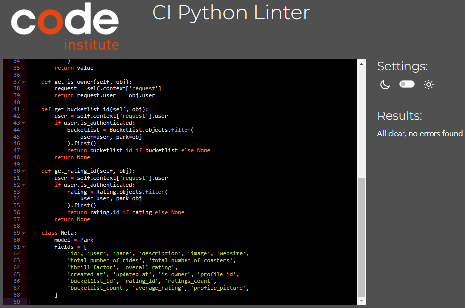

# Thrill Seeker API Testing

The testing.md file provides an overview of all tests that have been carried out specifically with the Thrill Seeker API.

## Content
1. [Code Validation](#code-validation)
2. [Manual testing](#manual-testing)
3. [Summary](#summary)

### Code Validation 
The python code of the backend was checked by a Pyton linter. The code Institute python linter was used for this purpes.
[CI Python Linter](https://pep8ci.herokuapp.com/) 

#### Backend
| Tested File    | Test Result                                                                                                             | Pass            |
| -------------- | ----------------------------------------------------------------------------------------------------------------------- | --------------- |
| permissions.py | 

backend permissions

 | Pass, No errors |
| serializers.py | 

backend serializers

 | Pass, No errors |
| settings.py    | 

backend settings

    | Pass, No errors |
| urls.py        | 

backend urls

        | Pass, No errors |
| views.py       | 

backend views

       | Pass, No errors |

#### Bucketlist
| Tested File    | Test Result                                                                                                             | Pass            |
| -------------- | ----------------------------------------------------------------------------------------------------------------------- | --------------- |
| models         | 

bucketlist models

   | Pass, No errors |
| serializers.py | 

bucketlist serializers

 | Pass, No errors |
| urls.py        | 

bucketlist urls

     | Pass, No errors |
| views.py       | 

bucketlist views

    | Pass, No errors |

#### Contact Form
| Tested File    | Test Result Screenshot                                                                                                    | Result          |
| -------------- | ------------------------------------------------------------------------------------------------------------------------- | --------------- |
| models         | 

contact_form models

   | Pass, No errors |
| serializers.py | 

contact_form serializers

 | Pass, No errors |
| urls.py        | 

contact_form urls

     | Pass, No errors |
| views.py       | 

contact_form views

    | Pass, No errors |

#### Rating
| Tested File    | Test Result Screenshot                                                                                              | Result          |
| -------------- | ------------------------------------------------------------------------------------------------------------------- | --------------- |
| models         | 

rating models

   | Pass, No errors |
| serializers.py | 

rating serializers

 | Pass, No errors |
| urls.py        | 

rating url

     | Pass, No errors |
| views.py       | 

rating view

    | Pass, No errors |

#### Like
| Tested File    | Test Result Screenshot                                                                                            | Result          |
| -------------- | ----------------------------------------------------------------------------------------------------------------- | --------------- |
| models         | 

like models

   | Pass, No errors |
| serializers.py | 

like serializers

 | Pass, No errors |
| urls.py        | 

like urls

     | Pass, No errors |
| views.py       | 

like views

    | Pass, No errors |

#### Park
| Tested File    | Test Result Screenshot                                                                                            | Result          |
| -------------- | ----------------------------------------------------------------------------------------------------------------- | --------------- |
| models         | 

park models

   | Pass, No errors |
| serializers.py | 

park serializers

 | Pass, No errors |
| urls.py        | 

park urls

     | Pass, No errors |
| views.py       | 

park views

    | Pass, No errors |

#### Profile
| Tested File    | Test Result Screenshot                                                                                               | Result          |
| -------------- | -------------------------------------------------------------------------------------------------------------------- | --------------- |
| models         | 

profile models

   | Pass, No errors |
| serializers.py | 

profile serializers

 | Pass, No errors |
| urls.py        | 

profile urls

     | Pass, No errors |
| views.py       | 

profile views

    | Pass, No errors |

### Manual testing
These steps were carried out to test the API manually:
1. Testing all urls Endpoints for proper functioning.
2. Checking the correct functioning of the apps. If what is expected happens during use and all functions work without problems. (CRUD functionality)
3. Testing the search function

#### URL Testing
| **Tested** | **Expected result** | **Result** | **Pass** |
--- | --- | --- | :---:

#### Functionality Testing - CRUD
| **Tested** | **Create** | **View** | **Update** | **Delete** |
--- | --- | --- | :---:| :---:

#### Search functionality
- Searching for park - name, park - description, park - user is working as expected.
